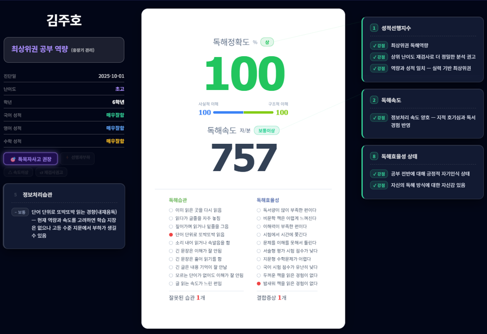
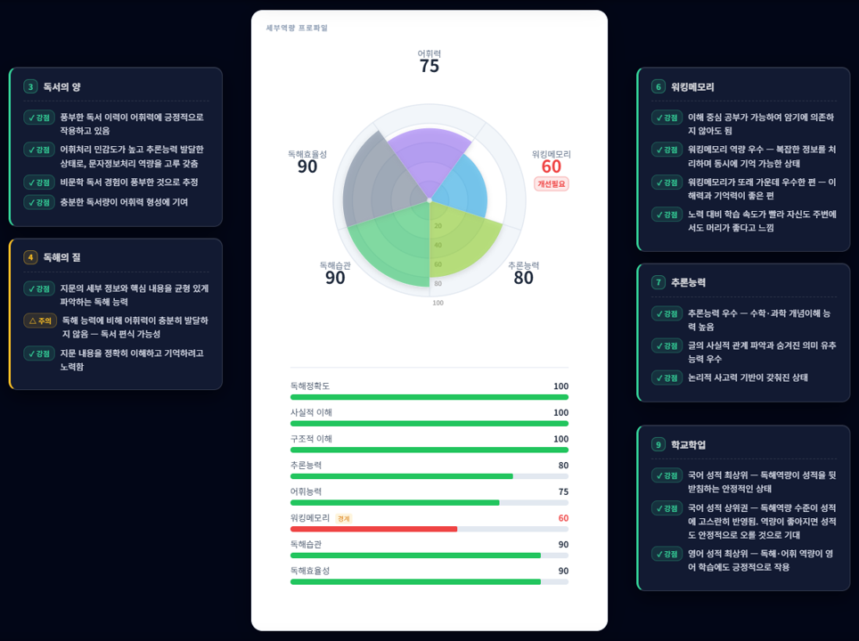
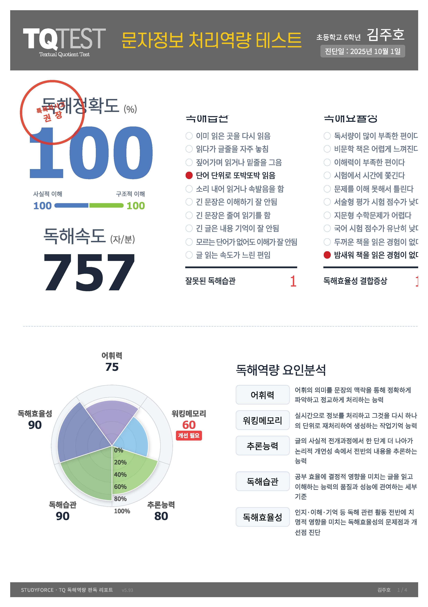
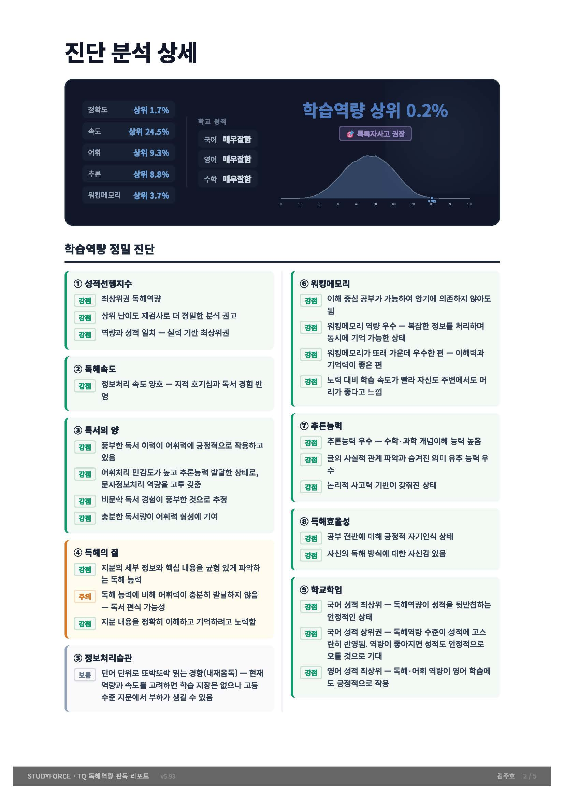
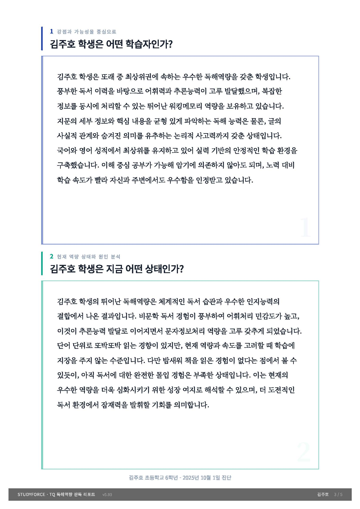
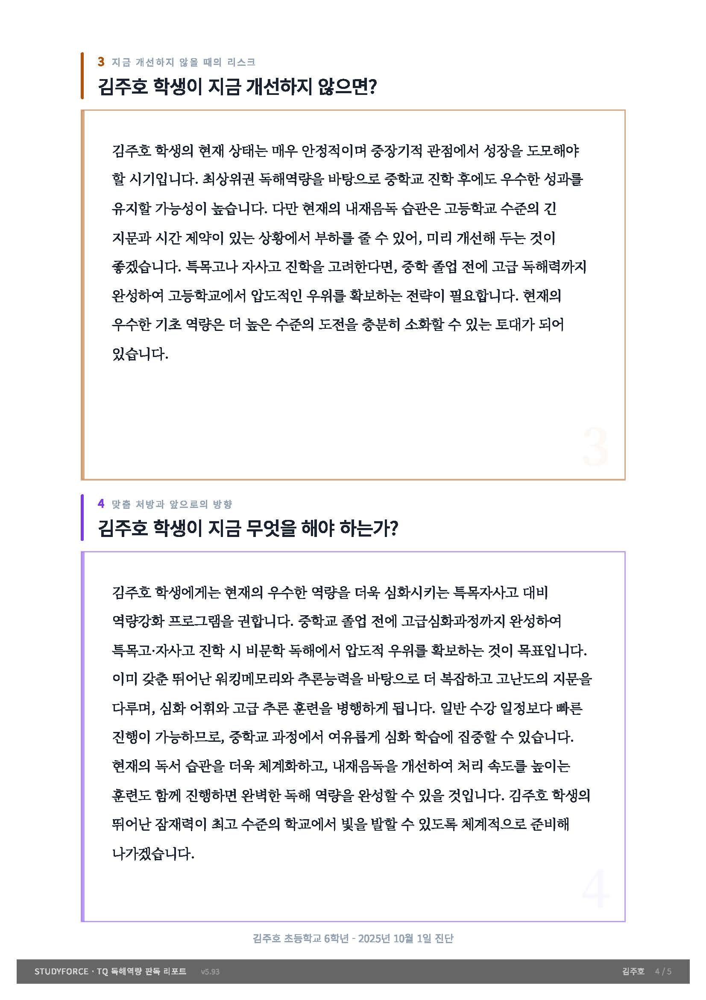
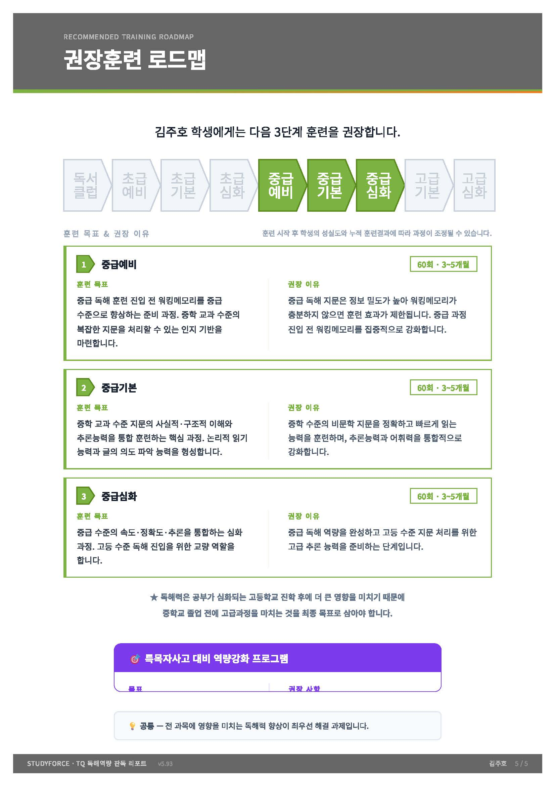

# TQ 컨설턴트 시스템 가이드

## 한 줄 요약
**73,032명의 실제 테스트 데이터를 기반으로, 초등~고등학생의 독해역량을 정밀 진단하고 AI가 맞춤 판독문과 훈련 처방을 생성하는 독해역량 분석 시스템**

---

## 1. 시스템의 목적

TQ(Textual Quotient)는 학생의 "글을 읽고 이해하는 능력"을 과학적으로 측정하고 분석하는 시스템입니다.

### 왜 독해역량인가?
- 국어뿐 아니라 수학(지문형 문제), 영어, 사회, 과학 등 **모든 과목의 기초 역량**
- 초등~중등에서는 성적으로 드러나지 않다가 **고등학교 진학 시 급격히 드러남**
- 학원을 많이 다녀도 독해력이 부족하면 **학습 효율이 낮아지는 근본 원인**

### 누구를 위한 시스템인가?
- **학부모**: 내 아이의 공부 역량 상태를 객관적으로 이해
- **학습 컨설턴트**: 학생 상담 시 데이터 기반 진단 근거 제공
- **학원**: 학생별 맞춤 훈련 프로그램 설계의 과학적 토대

---

### 📊 판독 콘솔 화면
> 컨설턴트가 사용하는 실시간 분석 화면입니다. 좌측에 학생 정보·유형·플래그 배지, 중앙에 테스트 결과와 PolarArea 차트, 우측에 9개 영역별 진단 근거가 표시됩니다.




### 📄 리포트 1페이지 — TQ 테스트 결과지
> 독해정확도, 독해속도, 5개 요인 PolarArea 차트, 체크리스트 상태를 한 눈에 보여줍니다.



---

## 2. 측정하는 것들

### 핵심 지표 5가지
| 지표 | 설명 | 왜 중요한가 |
|------|------|-------------|
| **독해정확도** | 글을 읽고 내용을 정확하게 파악하는 능력 (사실이해 + 구조이해) | 모든 학습의 기본. 정확하게 읽지 못하면 공부 자체가 성립하지 않음 |
| **독해속도** | 글을 읽는 속도 (자/분) | 시험 시간 내 문제를 풀 수 있는지를 결정 |
| **어휘력** | 문맥 속에서 어휘의 의미를 파악하는 능력 | 독서량과 직결. 어휘가 부족하면 지문 자체를 이해할 수 없음 |
| **추론능력** | 글에 직접 나오지 않은 내용을 논리적으로 유추하는 능력 | 수학 지문형 문제, 수능 국어의 핵심 역량 |
| **워킹메모리** | 읽으면서 정보를 동시에 처리하고 기억하는 작업기억 능력 | 부족하면 긴 문장을 읽어도 앞 내용이 기억나지 않음 |

### 자가진단 체크리스트 2종
- **독해습관** (10항목): "이미 읽은 곳을 다시 읽음", "소리 내어 읽음" 등 → 음독 습관, 재처리 패턴 분석
- **독해효율성** (10항목): "시험에서 시간에 쫓긴다", "문제를 이해 못해서 틀린다" 등 → 실전 영향도 분석

---

## 3. 분석 엔진의 작동 방식

### 3단계 분석 프로세스

```
[TQ 테스트 결과] → [규칙 기반 엔진] → [AI 판독문 생성] → [맞춤 리포트]
     입력              분석                해석              출력
```

### Step 1: 9개 영역 정밀 진단

엔진은 입력된 수치와 체크리스트를 9개 진단 영역으로 교차 분석합니다.

| # | 영역 | 분석 내용 |
|---|------|----------|
| ① | **성적선행지수** | 독해역량과 학교 성적이 일치하는가? 괴리가 있다면 왜? |
| ② | **독해속도** | 읽는 속도가 정확도와 어떤 관계인가? |
| ③ | **독서의 양** | 어휘력을 프록시로 독서 경험의 폭과 깊이 판단 |
| ④ | **독해의 질** | 사실이해 vs 구조이해 갭 → 읽기 패턴의 품질 |
| ⑤ | **정보처리습관** | 음독/재처리/이해결손 등 습관의 원인과 영향 분석 |
| ⑥ | **워킹메모리** | 작업기억 용량이 학습에 미치는 실제 영향 |
| ⑦ | **추론능력** | 논리적 사고력의 수준과 이과적 소양 |
| ⑧ | **독해효율성** | 독해 관련 문제가 실제 시험 점수에 미치는 영향 |
| ⑨ | **학교학업** | 국어/영어/수학 성적과 독해역량의 상관관계 |

각 영역에서 조건에 따라 **강점/보통/주의/위험** 태그가 부여된 근거 문장이 생성됩니다.

### Step 2: 유형 분류

정확도와 추론능력의 조합으로 **학습자 유형**을 분류합니다:

| 유형 | 조건 | 설명 |
|------|------|------|
| 최상위 완성 역량형 | 정확도 90+, 추론+어휘 130+ | 모든 역량이 최상위 |
| 고역량 잠재력 미개방형 | 정확도 90+, 일부 결함 | 높지만 부분적 보완 필요 |
| 성실한 암기 의존형 | 정확도 70+, 추론 50 미만 | 암기로 성적 유지, 고등 위험 |
| 논리 두뇌 미발현형 | 정확도 50+, 추론 70+ | 잠재력 있으나 독해력 부족 |
| 역량 모순 붕괴 예고형 | 성적 높고 역량 낮음 | 가장 위험한 패턴 |
| ... | ... | 총 10개 유형 |

### Step 3: 특수 플래그 감지

| 플래그 | 의미 | 조건 |
|--------|------|------|
| 🎯 특목자사고 권장 | 특목/자사고 진학 설계 가능 | 정확도 90+ AND 추론+어휘 140+ |
| 💎 이과적 소양 잠재 | 논리적 사고력 보유 | 추론 70+ AND 정확도 69 이하 |
| 🚨 학습 역량 부재 | 심각한 학습 기능 문제 | 정확도 29 이하 AND 추론+어휘 80 미만 |
| ⚠️ 성적 붕괴 위기 | 성적 급락 임박 | 성적 상위권인데 정확도 30 이하 |

### Step 4: AI 판독문 생성

Anthropic Claude Sonnet API가 엔진 분석 결과를 바탕으로 **4개 슬롯의 맞춤 판독문**을 생성합니다:

| 슬롯 | 질문 | 역할 |
|------|------|------|
| 1 | "이 학생은 어떤 학습자인가?" | 강점과 가능성 중심 서술 |
| 2 | "지금 어떤 상태인가?" | 현재 역량 상태와 원인 분석 |
| 3 | "지금 개선하지 않으면?" | 방치 시 리스크 경고 |
| 4 | "지금 무엇을 해야 하는가?" | 맞춤 처방과 희망적 마무리 |

**판독문 생성 규칙:**
- 점수(숫자)를 직접 언급하지 않음 → 학부모가 숫자에 매몰되지 않도록
- 낙인 표현 절대 금지 → "이 학생은 못 한다"가 아니라 "이 부분이 강화되면"
- 학제별 톤 차등 → 초등은 밝고 발달적, 고등은 입시와 직결
- 체크리스트는 "현상 → 원인 해석"으로 변환

---

## 4. 훈련 로드맵

분석 결과에 따라 **3단계 맞춤 훈련 코스**를 자동 추천합니다. 컨설턴트는 코스 선택과 개별 과정을 수동으로 조정할 수도 있습니다.

### 🔧 권장 로드맵 수정 기능
> 자동 추천된 코스(★ 표시)를 기반으로, 컨설턴트가 코스 패키지를 변경하거나 개별 과정을 직접 선택/해제할 수 있습니다.


### 코스 패키지
| 코드 | 대상 수준 | 구성 |
|------|-----------|------|
| PK06-1 | 초급0 | 비문학독서클럽 → 초급예비 → 초급기본 |
| PK06 | 초급1 | 초급예비 → 초급기본 → 초급심화 |
| PK07 | 초급2 | 초급예비 → 초급심화 → 중급기본 |
| PK08 | 중급1 | 중급예비 → 중급기본 → 중급심화 |
| PK09 | 중급2 | 중급심화 → 고급기본 → 고급심화 |
| PK10 | 고급1 | 고급기본 → 고급심화 |

### 훈련 프로그램 카탈로그
- **독해포스**: 초급/중급/고급 각 3단계, 60회차, 3~5개월
- **비문학독서클럽**: 6개 분야 독서 훈련, 50회차, 2개월
- **수리포스**: 직관연산/사고연산/직관도형/사고도형, 120회차, 6~10개월
- **매직보카**: 초등/중학/고등 어휘 훈련, 60회차, 3~5개월
- **특목 프로그램**: 후엠아이(Who Am I), 딥앤와이드(Deep & Wide), 50회차, 6개월

### 몰입훈련 제도
- **대상**: 초6 이상, 정확도 30 이하 필수 / 31~50 권장
- **방식**: 1일 4~6시간, 주 5회, 2~3개월 집중
- **목표**: 또래 수준 역량 회복 기간 최대 단축

---

## 5. 백분위 체계

**73,032명의 실제 TQ 테스트 데이터**를 기반으로 한 백분위 시스템:

### 종합점수 산출 공식
```
종합점수 = 정확도×0.4 + 속도(정규화)×0.15 + 어휘×0.15 + 추론×0.15 + 워킹메모리×0.15
```

### 주요 기준점
- 상위 10% 이내: 최상위권 역량
- 상위 30% 이내: 특목/자사고 진학 가능 역량
- 상위 50%: 평균 수준
- 하위 30%: 개선 필요
- 하위 10%: 시급 개선

### 정규분포 그래프
- SVG 기반 실데이터 분포 곡선
- 학생 위치를 점선으로 표시
- 상위 50% 이내 = 파란색 채움 / 하위 50% = 빨간색 채움

---

## 6. 리포트 출력

A4 크기(794×1123px) 인쇄용 리포트를 생성합니다.

### 페이지 구성

**1페이지 — TQ 테스트 결과지**: PolarArea 차트(5개 요인), 독해속도, 체크리스트 시각화, 유형 배지


**2페이지 — 진단 분석 상세**: 3컬럼 다크카드(TQ지표 + 학교성적 + 정규분포 그래프), 9개 영역별 정밀 진단 카드



**3~4페이지 — AI 판독문**: 4슬롯 판독문 (2슬롯씩 1페이지)




**5페이지 — 맞춤 훈련 로드맵**: 3단계 훈련 코스 + 몰입훈련 안내



---

## 7. 기술 아키텍처

### 프론트엔드
- **순수 HTML/CSS/JS** (프레임워크 없음)
- SVG 기반 차트 (PolarArea, 정규분포 곡선)
- CSS Grid/Flexbox 반응형 레이아웃
- 브라우저 Print API로 PDF 출력

### 백엔드
- **Supabase Edge Functions** (Deno 런타임)
- **Supabase PostgreSQL** (데이터 저장)
- **Anthropic Claude API** (OCR + 판독문 생성)

### 데이터 흐름
```
sfos.kr (학원 시스템)
    ↓ postMessage
tq_v5_prod.html (프론트엔드)
    ↓ fetch
Supabase Edge Function (tq-engine)
    ├── action:engine → 규칙 기반 분석
    ├── action:generate → Claude API 판독문 생성
    ├── action:save → PostgreSQL 저장
    └── action:load → 기존 결과 조회
    ↓
결과 렌더링 + 리포트 출력
```

### 보안
- 학원별 토큰 인증 (x-academy-token)
- postMessage 출처 검증 (sfos.kr, sfcenter.co.kr 도메인만 허용)

---

## 8. 시스템의 강점

### 1) 데이터 기반 객관성
- 73,032명 실데이터 백분위 → 감이 아닌 통계 기반 진단
- 9개 영역 교차 분석 → 단순 점수가 아닌 **원인과 인과관계** 도출

### 2) AI 개인화 판독문
- 같은 점수라도 학제/성적/습관 조합에 따라 **완전히 다른 판독문** 생성
- 학부모가 이해할 수 있는 언어로 변환 (전문 용어 → 일상 표현)
- 4슬롯 구조로 "강점 → 현재 → 리스크 → 처방"의 논리적 흐름

### 3) 실전 처방 연결
- 진단에서 끝나지 않고 **구체적인 훈련 프로그램까지 자동 추천**
- 각 프로그램에 "이 학생에게 왜 필요한지" AI가 개인화된 이유 생성
- 몰입훈련 제도로 심각한 경우 즉각적 개입 가능

### 4) 모순 패턴 감지
- "성적은 좋은데 독해력이 낮은" 위험 패턴을 자동 감지
- 학부모가 모르는 **숨겨진 학습 위기**를 사전에 경고
- 고등학교 진학 후 성적 급락을 **예측하고 예방**

### 5) 확장 가능한 설계
- 외부 시스템(sfos.kr)과 postMessage로 연동
- Supabase 기반으로 학원별 독립 운영 가능
- 엔진 규칙과 AI 프롬프트를 분리하여 독립 업데이트 가능

---

## 9. 용어 사전

| 용어 | 설명 |
|------|------|
| TQ | Textual Quotient. 문자정보 처리역량 지수 |
| acc | 독해정확도 (accuracy). (사실이해+구조이해)/2 |
| fct | 사실이해 (fact). 세부 정보 파악 능력 |
| str | 구조이해 (structure). 글의 구조/흐름/의도 파악 |
| spd | 독해속도 (speed). 자/분 단위 |
| voc | 어휘력 (vocabulary) |
| wm | 워킹메모리 (working memory) |
| inf | 추론능력 (inference) |
| hab | 독해습관 점수 |
| eff | 독해효율성 점수 |
| gap | 사실이해 - 구조이해 차이 |
| bt | 유형코드 (S1, A1, M2 등) |
| urg | 긴급도 (즉각/조기/중장기) |
| slot1~4 | AI 판독문 4개 슬롯 |
| evidence | 9개 영역별 진단 근거 데이터 |
| flagC | 모순패턴 플래그 |
| flagTeukmok | 특목자사고 권장 플래그 |
